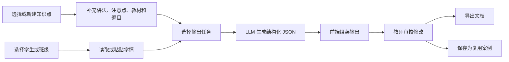

# PRD v0.2：知识点学情适配器

## 一、产品定位

一备多用适配器是一个面向教师的备课减负工具。它把“教师已经准备好的知识点”管理成可复用资产，再结合学生或班级的学情，生成多个教学出口：个性化教案、课堂导入、分层练习、自学材料、家长说明和课后反馈。

一句话：

> 不是让 AI 重新备课，而是让老师备好的知识点在不同学生、班级和教学场景中持续复用。

## 二、目标用户

| 用户 | 需求 | 产品价值 |
|------|------|----------|
| 任课老师 | 同一知识点要给不同学生或班级讲 | 生成个性化导入、讲法和练习 |
| 新接手老师 | 第一次带某类学生，不知道怎么讲 | 复用历史优秀案例和教师讲法 |
| 教研负责人 | 想沉淀知识点、题库、教材和讲法 | 把个人经验变成团队资产 |
| 家长沟通场景 | 家长听不懂课堂专业话 | 自动改写为家长可理解版本 |
| 请假或补学学生 | 无法听完整课堂 | 生成自学版和复习清单 |

## 三、核心场景

### 场景 A：课前个性化备课

教师选择一个知识点，再选择学生或班级。系统读取该对象的学情，生成适合本节课的个性化教案。

关键输出：

- 10-15 分钟个性化导入
- 核心知识讲解结构
- 与前置知识的连接
- 分层练习
- 易错提醒

### 场景 B：知识点资产管理

教师在网页端维护知识点卡。每个知识点下可以写 Markdown，上传 PDF 或图片，绑定教材页、题目和历史讲法。

关键输出：

- 知识点卡
- 教师讲法库
- 注意点和误区
- 关联教材与题目
- 相关附件

### 场景 C：课后反馈生成

教师粘贴本次课堂录音转写，选择本节课知识点。系统把“本次课堂表现 + 知识点目标”合并，生成给学生和家长的反馈。

关键输出：

- 学生本节课表现摘要
- 知识点掌握判断
- 家长可理解说明
- 后续练习建议

### 场景 D：复用案例沉淀

教师觉得某一次个性化教案或反馈很好，可以保存为复用案例。后续遇到相似学生或相似班级时，系统可引用这个案例。

关键输出：

- 脱敏案例
- 适用学生类型
- 关联知识点
- 可复用讲法
- 可复用练习结构

## 四、MVP 范围

### 必做

1. 知识点列表与知识点详情页。
2. 知识点详情页支持 Markdown 编辑。
3. 知识点下可上传或登记 PDF、图片、题目、教材引用。
4. 支持创建学生画像或班级画像。
5. 支持粘贴学情文本或课堂转写文本。
6. 支持选择“知识点 + 学生/班级 + 输出类型”。
7. 大模型返回结构化 JSON。
8. 前端把 JSON 组装为可阅读页面。
9. 支持导出 Markdown，PDF 下载作为候选增强。
10. 保存本次生成结果为复用案例。

### 暂缓

1. 自动音频转写。
2. 完整学生数据库同步。
3. 飞书、微信、教务系统集成。
4. 多用户权限系统。
5. 大规模题库自动检索。
6. 完整 PDF 排版引擎。

## 五、用户流程



## 六、输出类型

| 输出类型 | 输入组合 | 主要内容 |
|----------|----------|----------|
| 个性化教案 | 知识点 + 学情 | 导入、讲法、节奏、练习、提醒 |
| 分层练习 | 知识点 + 学情 + 题库 | 基础题、进阶题、迁移题 |
| 学生自学版 | 知识点 + 缺课/补学场景 | 背景说明、步骤、自检题 |
| 家长说明版 | 知识点 + 学生表现 | 学什么、难在哪、怎么配合 |
| 课后反馈 | 知识点 + 本次课堂转写 | 表现、掌握、建议、下次目标 |
| 复用案例 | 任一优质输出 | 脱敏后的讲法与任务模板 |

## 七、结构化生成合约

大模型返回应优先使用 JSON，便于网页端稳定组装。

```json
{
  "knowledgePointId": "kp_001",
  "learnerContextId": "student_or_class_001",
  "outputType": "personalized_lesson_plan",
  "coreInvariant": {
    "goals": [],
    "mustKeepConcepts": [],
    "commonMisconceptions": []
  },
  "personalizedIntro": {
    "durationMinutes": 12,
    "rationale": "",
    "script": ""
  },
  "lessonPlan": {
    "sections": []
  },
  "exerciseSet": {
    "items": []
  },
  "parentExplanation": {
    "summary": "",
    "homeSupport": []
  },
  "reviewNotes": {
    "needsTeacherCheck": [],
    "privacyWarnings": []
  }
}
```

## 八、界面要求

### 知识点管理页

- 左侧：知识点列表、标签、搜索。
- 中间：Markdown 编辑器，编辑核心讲法、注意点、误区。
- 右侧：关联资源，包括教材、题目、附件、历史案例。

### 生成工作台

- 顶部：选择知识点、学生/班级、输出类型。
- 左侧：学情输入框，支持粘贴课堂转写。
- 中间：生成结果预览。
- 右侧：版本差异、引用来源、需要教师确认的风险点。

### 复用案例库

- 按知识点、学生类型、输出类型筛选。
- 案例必须脱敏，不能直接暴露真实学生姓名。
- 案例可被再次引用，成为后续生成的参考。

## 九、知识管理界面参考

可参考本地刘老师研究生论文项目的可视化资料组织方式：

- `../刘老师研究生论文项目/04-可视化/index.html`
- `../刘老师研究生论文项目/04-可视化/问题解释/index.html`
- `../刘老师研究生论文项目/04-可视化/20260625-中期答辩产物路径地图.html`

可借鉴的不是数学内容本身，而是以下界面思想：

1. 每个核心概念有独立解释页。
2. 主入口负责导航、状态和路径。
3. 页面既能自学，也能作为讲解工具。
4. 条目和可视化之间互相链接。

## 十、风险与边界

1. 知识准确性必须由教师审核，系统不能自动替代教研判断。
2. 学生真实信息进入复用案例前必须脱敏。
3. 第一阶段不承诺自动识别音频，先支持转写文本。
4. 题库匹配可以先人工绑定，后续再做自动检索。
5. PDF 下载不应阻塞核心闭环，优先保证结构化输出可读可改。

## 十一、第一版验收标准

1. 能新建一个知识点卡，并写入 Markdown 讲法。
2. 能上传或登记至少一个教材/题目资源。
3. 能创建两个不同学生画像。
4. 同一知识点能分别生成两个学生的个性化教案。
5. 每份教案至少包含个性化导入、固定知识点讲解、个性化练习。
6. 能粘贴一段课堂转写并生成家长反馈。
7. 能把一份优质输出保存为脱敏复用案例。
