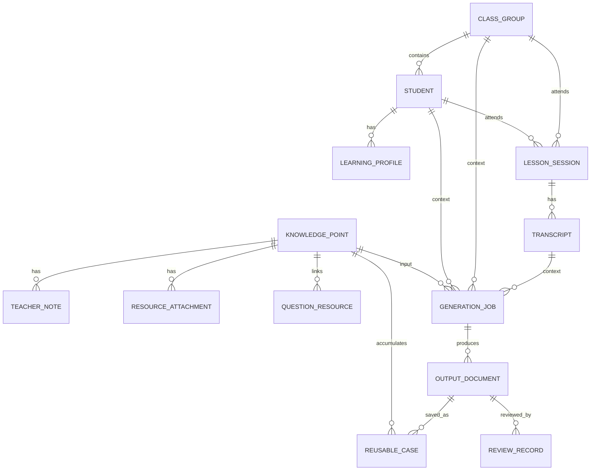

# 实体模型 v0.2

## 一、总览

本项目的实体分为五组：

1. 知识资产：知识点、讲法、附件、教材、题目。
2. 学情资产：学生、班级、画像、学习地图、课堂记录。
3. 生成任务：输入包、Prompt、LLM 返回、输出文档。
4. 教学产物：个性化教案、练习、家长说明、课后反馈。
5. 复用资产：脱敏案例、版本快照、审核记录。

## 二、实体关系图



## 三、核心实体

### 1. KnowledgePoint 知识点

教师复用的核心资产。

| 字段 | 类型 | 说明 |
|------|------|------|
| id | string | 知识点唯一 ID |
| title | string | 知识点名称 |
| subject | string | 学科，如语文 |
| stage | string | 学段，如初中/高中 |
| category | string | 分类，如文言、作文、阅读 |
| summary | markdown | 一句话说明 |
| coreContent | markdown | 核心定义与讲解 |
| teachingMethod | markdown | 教师讲法 |
| misconceptions | markdown | 常见误区 |
| prerequisiteIds | string[] | 前置知识点 |
| nextIds | string[] | 后续知识点 |
| tags | string[] | 标签 |
| createdAt | datetime | 创建时间 |
| updatedAt | datetime | 更新时间 |

### 2. TeacherNote 教师补充笔记

知识点下的补充说明，用于积累讲法、注意点和临场经验。

| 字段 | 类型 | 说明 |
|------|------|------|
| id | string | 笔记 ID |
| knowledgePointId | string | 所属知识点 |
| title | string | 笔记标题 |
| noteType | enum | 讲法/注意点/易错点/案例/板书 |
| body | markdown | 正文 |
| visibility | enum | 私有/团队可见 |
| source | string | 来源说明 |
| updatedAt | datetime | 更新时间 |

### 3. ResourceAttachment 资源附件

上传到知识点下的 PDF、图片、文档或链接。

| 字段 | 类型 | 说明 |
|------|------|------|
| id | string | 附件 ID |
| knowledgePointId | string | 所属知识点 |
| fileName | string | 文件名 |
| fileType | enum | pdf/image/doc/link/markdown |
| pathOrUrl | string | 本地路径或 URL |
| description | string | 说明 |
| extractedTextPath | string | 可选，提取后的文本路径 |
| uploadedAt | datetime | 上传时间 |

### 4. TextbookResource 教材资源

教材片段、页码、单元或课文。

| 字段 | 类型 | 说明 |
|------|------|------|
| id | string | 教材资源 ID |
| subject | string | 学科 |
| stage | string | 学段 |
| book | string | 册别 |
| unit | string | 单元 |
| title | string | 篇目或章节 |
| pageRange | string | 页码 |
| filePath | string | 本地文件路径 |
| linkedKnowledgePointIds | string[] | 关联知识点 |

### 5. QuestionResource 题目资源

知识点可调用的题目。

| 字段 | 类型 | 说明 |
|------|------|------|
| id | string | 题目 ID |
| stem | markdown | 题干 |
| answer | markdown | 答案 |
| explanation | markdown | 解析 |
| difficulty | enum | 基础/标准/提高 |
| questionType | string | 题型 |
| source | string | 来源 |
| linkedKnowledgePointIds | string[] | 关联知识点 |
| suitableLearnerTags | string[] | 适合的学生类型 |

## 四、学情实体

### 6. Student 学生

真实学生。复用案例中不得直接暴露真实姓名。

| 字段 | 类型 | 说明 |
|------|------|------|
| id | string | 学生 ID |
| displayName | string | 显示名 |
| grade | string | 年级 |
| subject | string | 学科 |
| tags | string[] | 学情标签 |
| privacyLevel | enum | 真实/脱敏/匿名 |
| createdAt | datetime | 创建时间 |

### 7. ClassGroup 班级或学生组

可以是一对多班级，也可以是一类学生。

| 字段 | 类型 | 说明 |
|------|------|------|
| id | string | 班级或分组 ID |
| name | string | 名称 |
| groupType | enum | 班级/层次组/临时组 |
| studentIds | string[] | 成员学生 |
| profileSummary | markdown | 整体画像 |
| tags | string[] | 分组标签 |

### 8. LearningProfile 学情画像

学生或班级当前的学习状态。

| 字段 | 类型 | 说明 |
|------|------|------|
| id | string | 学情画像 ID |
| ownerType | enum | student/class |
| ownerId | string | 学生或班级 ID |
| strengths | markdown | 优势 |
| weaknesses | markdown | 薄弱点 |
| prerequisiteStatus | markdown | 前置知识掌握情况 |
| learningStyle | markdown | 学习特点 |
| recentPerformance | markdown | 最近表现 |
| sourceRefs | string[] | 来源，如课堂记录、反馈、手动输入 |
| updatedAt | datetime | 更新时间 |

### 9. LearningMap 学习地图

学生或班级围绕知识点的掌握路径。

| 字段 | 类型 | 说明 |
|------|------|------|
| id | string | 学习地图 ID |
| ownerType | enum | student/class |
| ownerId | string | 学生或班级 ID |
| masteredKnowledgePointIds | string[] | 已掌握知识点 |
| weakKnowledgePointIds | string[] | 薄弱知识点 |
| nextRecommendedIds | string[] | 推荐后续知识点 |
| evidenceRefs | string[] | 证据来源 |

### 10. LessonSession 课堂记录

一次真实授课。

| 字段 | 类型 | 说明 |
|------|------|------|
| id | string | 课堂 ID |
| date | date | 授课日期 |
| teacherId | string | 老师 ID |
| studentIds | string[] | 学生 |
| classGroupId | string | 班级，可选 |
| knowledgePointIds | string[] | 本节涉及知识点 |
| lessonGoal | markdown | 本节目标 |
| summary | markdown | 课堂摘要 |
| recordingAssetId | string | 录音文件，可选 |
| transcriptId | string | 转写文本，可选 |

### 11. Transcript 转写文本

录音或手动粘贴得到的文本。MVP 先支持粘贴文本，后续再接 STT。

| 字段 | 类型 | 说明 |
|------|------|------|
| id | string | 转写 ID |
| sourceType | enum | manual_paste/stt/import |
| audioAssetId | string | 原始音频，可选 |
| text | markdown | 转写正文 |
| cleanedText | markdown | 清洗后文本 |
| speakerNotes | markdown | 说话人或角色标注 |
| confidence | number | STT 置信度，可选 |
| createdAt | datetime | 创建时间 |

## 五、生成与产物实体

### 12. GenerationJob 生成任务

一次生成行为。

| 字段 | 类型 | 说明 |
|------|------|------|
| id | string | 任务 ID |
| jobType | enum | lesson_plan/exercise/parent_note/feedback/self_study |
| knowledgePointIds | string[] | 输入知识点 |
| targetType | enum | student/class/learner_type |
| targetId | string | 目标对象 |
| transcriptId | string | 使用的转写，可选 |
| selectedResourceIds | string[] | 使用的题目、教材、附件 |
| promptTemplateId | string | 使用的 Prompt 模板 |
| model | string | 模型 |
| inputSnapshotPath | string | 输入快照 |
| outputJsonPath | string | 输出 JSON |
| status | enum | draft/running/succeeded/failed/reviewed |

### 13. PersonalizedLessonPlan 个性化教案

课前或课中使用的主输出。

| 字段 | 类型 | 说明 |
|------|------|------|
| id | string | 教案 ID |
| generationJobId | string | 来源任务 |
| targetSummary | markdown | 对象学情摘要 |
| personalizedIntro | markdown | 个性化导入 |
| fixedCoreTeaching | markdown | 固定知识点讲解 |
| adaptiveTeachingMoves | markdown | 个性化讲法调整 |
| exerciseSetId | string | 练习集 |
| estimatedDuration | number | 预计时长 |
| teacherCheckItems | markdown | 需教师确认项 |

### 14. ExerciseSet 练习集

根据知识点和学情生成的练习。

| 字段 | 类型 | 说明 |
|------|------|------|
| id | string | 练习集 ID |
| generationJobId | string | 来源任务 |
| levels | object | 基础/标准/提高 |
| sourceQuestionIds | string[] | 引用题目 |
| customItems | markdown | 模型改写或新生成题 |
| rationale | markdown | 为什么这样选题 |

### 15. FeedbackReport 课后反馈

给学生或家长的反馈。

| 字段 | 类型 | 说明 |
|------|------|------|
| id | string | 反馈 ID |
| lessonSessionId | string | 对应课堂 |
| knowledgePointIds | string[] | 涉及知识点 |
| studentPerformance | markdown | 学生表现 |
| masteryJudgment | markdown | 掌握判断 |
| parentReadableSummary | markdown | 家长可读说明 |
| nextActions | markdown | 后续建议 |
| privacyChecked | boolean | 是否已脱敏/检查 |

### 16. OutputDocument 输出文档

前端组装出的可阅读结果。

| 字段 | 类型 | 说明 |
|------|------|------|
| id | string | 文档 ID |
| generationJobId | string | 来源任务 |
| documentType | enum | markdown/html/pdf/json |
| title | string | 标题 |
| path | string | 文件路径 |
| status | enum | draft/final/archived |
| createdAt | datetime | 创建时间 |

## 六、复用与审核实体

### 17. ReusableCase 复用案例

从某次输出中沉淀出来的可复用资产。

| 字段 | 类型 | 说明 |
|------|------|------|
| id | string | 案例 ID |
| sourceOutputDocumentId | string | 来源输出 |
| knowledgePointIds | string[] | 关联知识点 |
| learnerTypeTags | string[] | 适用学生类型 |
| caseTitle | string | 案例标题 |
| caseBody | markdown | 脱敏案例正文 |
| reusableParts | markdown | 可复用部分 |
| anonymized | boolean | 是否脱敏 |
| approvedByTeacher | boolean | 是否老师确认 |

### 18. ReviewRecord 审核记录

教师对输出的审核与修改。

| 字段 | 类型 | 说明 |
|------|------|------|
| id | string | 审核 ID |
| outputDocumentId | string | 被审核文档 |
| reviewer | string | 审核人 |
| decision | enum | accept/revise/reject |
| issues | markdown | 问题 |
| editsSummary | markdown | 修改摘要 |
| reviewedAt | datetime | 审核时间 |

### 19. PromptTemplate Prompt 模板

结构化生成的提示词模板。

| 字段 | 类型 | 说明 |
|------|------|------|
| id | string | 模板 ID |
| name | string | 模板名称 |
| jobType | enum | 任务类型 |
| version | string | 版本 |
| systemPrompt | markdown | 系统提示 |
| userPromptTemplate | markdown | 用户提示模板 |
| outputSchema | json | 期望 JSON Schema |
| changelog | markdown | 变更记录 |

## 七、MVP 数据落盘建议

第一阶段不必直接上数据库，可以先用文件夹模拟实体。

```text
data/
├── knowledge-points/
│   └── kp_001/
│       ├── index.md
│       ├── notes/
│       ├── resources/
│       └── cases/
├── learners/
│   ├── students/
│   └── classes/
├── sessions/
│   └── 20260627-session-demo/
│       ├── transcript.md
│       └── summary.md
├── generation-jobs/
│   └── job_001/
│       ├── input.json
│       ├── output.json
│       └── output.md
└── reusable-cases/
```

## 八、隐私规则

1. 真实学生姓名只允许出现在私有学情资料中。
2. 复用案例必须脱敏，使用“学生 A”“基础薄弱型学生”等表达。
3. 上传录音或转写文本前应明确来源和使用范围。
4. 发送到外部 LLM API 的文本应尽量去掉真实姓名、联系方式和敏感家庭信息。
5. 教师审核是正式输出的必要环节。
